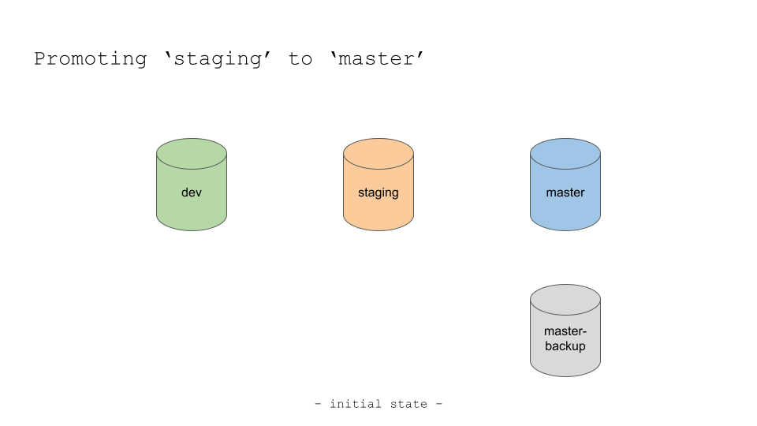
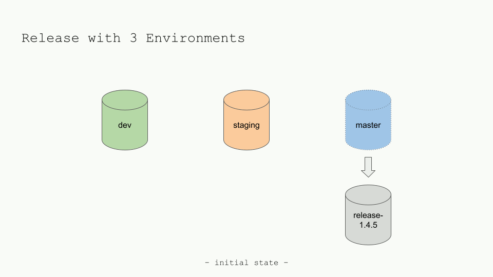
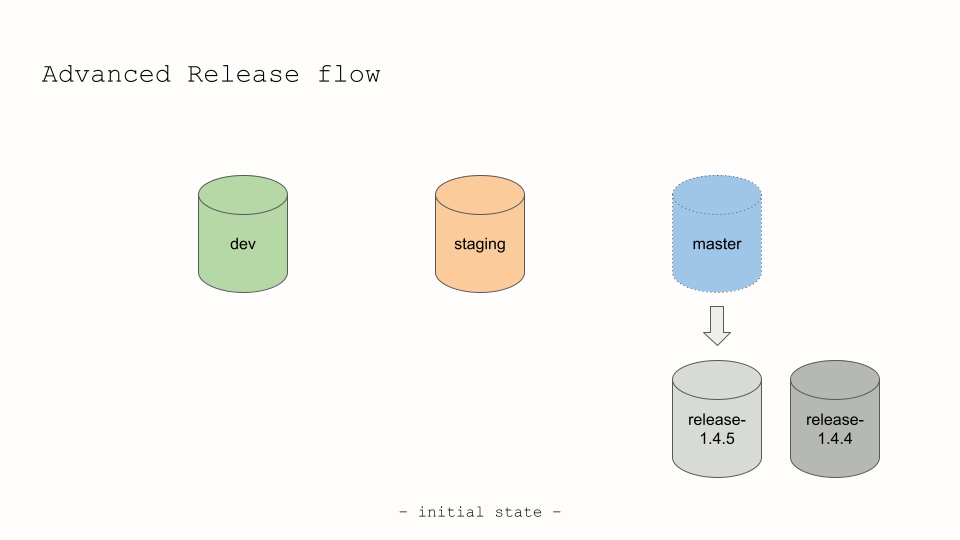

[](https://opensource.org/licenses/MIT)
[](https://npmjs.com/package/contentful-cli-release)


[](https://bun.sh)

# Contentful CLI Release Tool

This tool is a utility for managing releases in Contentful. It streamlines the process of branching, releasing, and
integrating with CI/CD pipelines such as GitLab or GitHub, by leveraging the use of Environments and Environment aliases.

<h3>Sponsored by <a href="https://github.com/AtidaTech"><b>Atida</b>
</a></h3>

<hr />

[✨ Features](#-features) · [💡 Installation](#-installation) · [📟 Example](#-example) · [🎹 Usage](#-usage) ·
[🚀 Release](#-managing-a-release) · [📅 ToDo](#-todo) · [👾 Contributors](#-contributors) ·
[🎩 Acknowledgments](#-acknowledgements) · [📚 Collection](#-other-scripts-in-the-same-collection) ·
[📄 License](#-license)

<hr />

## ✨ Features

* **Branching & Releasing:** Seamless management of environments and releases in Contentful.
* **CI/CD Integration:** Designed for integration with CI/CD pipelines like GitLab or GitHub.
* **Command Line Utility:** Efficient command-line interface for all release-related tasks.

## 💡 Installation

To use this helper library, you must have [Node.js 🔗](https://nodejs.org/) and [npm 🔗](http://npmjs.org) installed.

To install it, simply run:

``````shell
npm install contentful-cli-release --save
``````

Or, if using [yarn 🔗](https://yarnpkg.com/lang/en/):

```shell
yarn add contentful-cli-release
```

Similarly, if you are using [Bun 🔗](https://bun.sh), just run:

```shell
bun add contentful-cli-release
```

### Requirements

* `node` >= 18.0.0
* `npm` >= 9.5.0
* `contentful-management` >= 7.50.0
* [contentful-lib-helpers](https://www.npmjs.com/package/contentful-lib-helpers) >= 0.3.3


### Set-up

To get the most out of the Contentful CLI Release tool, proper setup is crucial. Here's a step-by-step guide to help
you get started:

1. **Environment Variables**:
   The tool uses environment variables to simplify repetitive tasks and ensure security. Instead of passing sensitive
   data as command line arguments every time, you can set them once in your environment. We recommend using a `.env`
   file for this purpose. Here's a sample configuration:

   ```env
   CMS_MANAGEMENT_TOKEN=placeholder-management-token
   CMS_SPACE_ID=placeholder-space-id
   CMS_RELEASE_MAX_SCHEDULED_ACTIONS=500
   CMS_RELEASE_ENVIRONMENT_PROTECTED=dev,staging,master
   CMS_RELEASE_ENVIRONMENT_REGEX=release-[0-9]+[\\.]*[0-9]*[\\.]*[0-9]*
   ```

   Create the `.env` or `.env.local` files in your project to override the default configuration. But ensure to
   replace the placeholders (e.g., `placeholder-management-token` and `placeholder-space-id`) with your actual data.

[//]: # (CMS_RELEASE_SYNC_DB=./cli-release.db)
[//]: # (CMS_RELEASE_SYNC_CONFIG=./cli-release-config.js)

2. **Max Scheduled Actions**:
   The `CMS_RELEASE_MAX_SCHEDULED_ACTIONS` parameter sets the number of scheduled actions (in total) to be retrieved.
   Default and maximum value is `500`.

3. **Protected Environments**:
   The `CMS_RELEASE_ENVIRONMENT_PROTECTED` parameter lists environments that should not be modified by the tool,
   ensuring safety for crucial stages like `dev`, `staging`, and `master`.

3. **Environment Naming Convention**:
   Using the `CMS_RELEASE_ENVIRONMENT_REGEX`, you can specify a regex pattern to match the naming convention of your
   release environments. The default pattern matches names like `release-1`, `release-1.1`, and `release-1.1.1`.

With these steps, you should have a fully configured environment ready to utilize the Contentful CLI Release tool
effectively. Always refer back to the tool's documentation if you need further assistance.

## 📟 Example

### Duplicate an Environment

Duplicates an existing environment to a new environment, and it pings to see when the new environment is available.
It skips the duplication if the destination environment already exists.

Usage:

```bash
npx contentful-cli-release --duplicate --from SOURCE_ENV --to DEST_ENV (--update-api-key)
```

Arguments:

- `--from`: The name of the source environment to duplicate from. Ie: 'master'.
- `--to`: The name of the destination environment to duplicate to. Ie: 'release-1.7.4' or 'staging'.
- `--update-api-key`: It will enable, for the duplicated environment, the CDA API Key that has the same name of the
source environment (so, for environment 'master', the CDA API Key should be also called 'master').

> See the section [🎹 Usage](#-usage) for details on the command line options.

#### Response and Errors

<details>
  <summary>Successful duplication</summary>

```shell
$ npx contentful-cli-release --duplicate --from master --to release-1.7.4 --update-api-key
##/INFO: Duplicating environment 'master' for space 'xxxxxxxxx'
##/DEBUG: Creating new environment: 'release-1.7.4'
##/INFO: Environment 'release-1.7.4' successfully created
##/INFO: CDA 'master' Key assigned to environment: release-1.7.4
##/DEBUG: Waiting to retrieve the newly created environment: release-1.7.4
##/DEBUG: Waiting to retrieve the newly created environment: release-1.7.4
##/DEBUG: Waiting to retrieve the newly created environment: release-1.7.4
...
##/INFO: release-1.7.4 successfully duplicated from: master
```
</details>

<details>
  <summary>Skips creation, but associates the Key and pings the environment</summary>

```shell
$ npx contentful-cli-release --duplicate --from master --to release-1.7.4 --update-api-key
##/INFO: Duplicating environment 'master' for space 'xxxxxxxxx'
##/INFO: An environment with this name already exists: 'release-1.7.4'. Skipping creation
##/INFO: CDA 'master' Key assigned to environment: release-1.7.4
##/DEBUG: Waiting to retrieve the newly created environment: release-1.7.4
##/DEBUG: Waiting to retrieve the newly created environment: release-1.7.4
##/DEBUG: Waiting to retrieve the newly created environment: release-1.7.4
...
##/INFO: release-1.7.4 successfully duplicated from: master
```
</details>

<details>
  <summary>Error when Source environment doesn't exists</summary>

```shell
$ npx contentful-cli-release --duplicate --from myenvironment --to release-1.7.4
@@/ERROR: The source environment does not exist!
```
</details>

<details>
  <summary>Error when 'from' or 'to' environments are missing</summary>

```shell
$ npx contentful-cli-release --duplicate --from master
@@/ERROR: You should specify both a '--from' and a '--to' option.
```
</details>

### Sync Schedule

Synchronize scheduled actions between two Environments, because the actions are not copied when duplicating an
Environment. Ideally the source is the 'old' master and the destination is the newly created release environment.

Usage:

```bash
npx contentful-cli-release --sync-schedule --from SOURCE_ENV --to DEST_ENV (--force-yes)
```

Arguments:

- `--from`: The name of the source environment where the existing scheduled actions are. Ie: 'master'.
- `--to`: The name of the destination environment to copy the scheduled actions to. Ie: 'release-1.4.5'.
- `--force-yes`: When the destination environment is protected, this will allow to perform the action.

> See the section [🎹 Usage](#-usage) for details on the command line options.

#### Response and Errors

<details>
  <summary>Successful sync between two Environments</summary>

```shell
$ npx contentful-cli-release --sync-schedule --from master --to release-1.4.5 --force-yes
##/INFO: Source Environment: 'master'
##/INFO: Destination Environment: 'release-1.4.5'
##/INFO: Total Scheduled Actions: 2
##/DEBUG: Imported scheduled action: Publish for Entry-Id: '5krek3qkuRtWxRyIqM012a' for the: 2023-10-29 19:00
##/DEBUG: Imported scheduled action: Unpublish for Entry-Id: 'GKfodiofTQFS8oXjJp65Yb' for the: 2023-10-29 20:00
```
</details>


<details>
  <summary>Skips already imported actions (to avoid duplicates)</summary>

```shell
$ npx contentful-cli-release --sync-schedule --from master --to release-1.4.5 --force-yes
##/INFO: Source Environment: 'master'
##/INFO: Destination Environment: 'release-1.4.5'
##/INFO: Total Scheduled Actions: 2
##/DEBUG: Scheduled action already exists - Action-Id: 6jTzhTAOPs5LsbpjRZKkF3
##/DEBUG: Scheduled action already exists - Action-Id: 2HVGh3wJRSp8P6ZW18YI92
```
</details>

<details>
  <summary>Error when 'to' Environment is protected</summary>

```shell
$ npx contentful-cli-release --sync-schedule --from master --to staging
@@/ERROR: The destination environment is either empty or reserved!
```
</details>

<details>
  <summary>Error when 'from' or 'to' Environments are missing</summary>

```shell
$ npx contentful-cli-release --sync-schedule --from master
@@/ERROR: You should specify both a '--from' and a '--to' option.
```
</details>

### Link Alias
It links an existing alias from one Environment to another one. This is used during a Release to move, for example,
the 'master' alias from the old release branch to the new one

Usage:

```bash
npx contentful-cli-release --link --alias ALIAS --to TARGET_ENV (--prune-old-releases)
```

Arguments:

- `--alias`: The existing alias that needs to be updated. Ie: 'master'.
- `--to`: The target Environment-id to which the alias will point to. Ie: 'release-1.4.5'.
- `--prune-old-releases`: Using the release regular expression, it will delete all the older releases, except
the current one (ie: 'release-1.4.5') and the previous one (ie: 'release-1.4.4') that was associated with the
'master' alias.

> See the section [🎹 Usage](#-usage) for details on the command line options.

#### Response and Errors

<details>
  <summary>Successful use with the '--prune-old-releases' option</summary>

```shell
$ npx contentful-cli-release --link --alias master --to release-1.4.5 --prune-old-releases
##/INFO: Linking Environment 'release-1.4.5' to Alias 'master'
##/INFO: Alias 'master' updated to 'release-1.4.5' Environment.
##INFO: Deleting old Release Environments
##/INFO: Processing the list of all environments
##/INFO: This environment will NOT be deleted: dev
##/INFO: This environment will NOT be deleted: staging
##/INFO: This environment will NOT be deleted: release-1.4.5 aliased by master
##/INFO: List of Release environments that will be kept:
- release-1.4.5
- release-1.4.4
##/INFO: List of Release environments that will be deleted:
- release-1.4.3
##/DEBUG: Environment 'release-1.4.3' is going to be deleted!
##/INFO: Deleting environment 'release-1.4.3'.
##/DEBUG: Environment 'release-1.4.3' was deleted.
```
</details>

<details>
  <summary>Successful use without the '--prune-old-releases' option</summary>

```shell
$ npx contentful-cli-release --link --alias master --to release-1.4.5
##/INFO: Linking Environment 'release-1.4.5' to Alias 'master'
##/INFO: Alias 'master' updated to 'release-1.4.5' Environment.
```
</details>

<details>
  <summary>Error when '--alias' is missing</summary>

```shell
$ npx contentful-cli-release --link --to release-1.4.5
@@/ERROR: You should specify an '--alias' option when using '--link'
```
</details>

<details>
  <summary>Error when '--to' is missing</summary>

```shell
$ npx contentful-cli-release --link --alias master
@@/ERROR: You should specify an '--environment-id' option when using '--delete' or '--link'
```
</details>

### Delete an Environment
This function allows to delete an Environment via the CLI tool. It automatically forbids to delete the
configured protected environments, unless we use the option '--force-yes'.

Usage:

```bash
npx contentful-cli-release --delete --environment-id TARGET_ENV (--force-yes)
```

Arguments:

- `--environment-id`: The name of the environment to be deleted.
- `--force-yes`: When the destination environment is protected, this will allow to perform the action.

> See the section [🎹 Usage](#-usage) for details on the command line options.

#### Response and Errors

<details>
  <summary>Success when the environment is not protected</summary>

```shell
$ npx contentful-cli-release --delete --environment-id test
##/INFO: Deleting environment 'test'.
##/DEBUG: Environment 'test' was deleted.
```
</details>

<details>
  <summary>Error when the environment is protected</summary>

```shell
$ npx contentful-cli-release --delete --environment-id staging
@@/ERROR: Environment 'staging' is protected and cannot be deleted.
@@/ERROR: No action chosen or Returned an error. Inspect the logs and try again
```
</details>

<details>
  <summary>Success when using '--force-yes'</summary>

```shell
$ npx contentful-cli-release --delete --environment-id staging --force-yes
##/INFO: Deleting environment 'staging'.
##/DEBUG: Environment 'staging' was deleted.
```
</details>


<details>
  <summary>Error when '--environment-id' is missing</summary>

```shell
$ npx contentful-cli-release --delete
@@/ERROR: You should specify an '--environment-id' option when using '--delete' or '--link'
```
</details>

## 🎹 Usage

This script can be used from the command line and accepts various arguments for customization:

* `--space-id`: The Contentful space id. It will override the env value `CMS_SPACE_ID`.
* `--management-token` or `--mt`: The Contentful Management Token. It will override the env value `CMS_MANAGEMENT_TOKEN`.
* `--from`: The source Environment-id when performing a duplication or a sync-schedule.
* `--alias`: Mandatory only for the link alias option. It represents the alias that we want to associate with another
Environment.
* `--to` or `--environment-id`: The target Environment-id.
* `--update-api-key`: When performing a duplication. It enables a CDA API Key also for the new environment. The only
constraint is that the API Key should have the same name of the source Environment. Ie: 'master' API Key for the 'master'
Environment, that will be enabled also for the new duplicated release Environment.
* `--prune-old-releases`: When running a `--link` alias operation, it will keep the latest two releases and delete the
older ones. The releases are identified by the regular expression defined in the env file or overridden via additional
command line parameter.
* `--force-yes`: It forces the operation when the target Environment-id is considered protected. The protected
Environments are listed in the env value `CMS_RELEASE_ENVIRONMENT_PROTECTED` or overridden with the following option.
* `--protected-environments`: It sets a list (separated by comma) of protected environments. It overrides the env
value `CMS_RELEASE_ENVIRONMENT_PROTECTED`. This prevents accidentally deleting or performing operations on an
Environment that is used for production or for important day-to-day work. Ie: 'dev,staging,master'.
* `--release-regex`: It overrides the env value `CMS_RELEASE_ENVIRONMENT_REGEX`. It identifies a regular expression
that will match the release branch naming. The default one matches a fixed part `release-` and then the numbering
of a release, like `x.y.z`. The regular expression can be modified, however the script will use the numbering part
to do a natural ordering (so 1.4.10 is bigger than 1.4.9 and smaller than 1.5) when deciding which older releases
need to be automatically deleted when using `--prune-old-releases` option.
* `--max-scheduled-actions`: It overrides the env value `CMS_RELEASE_MAX_SCHEDULED_ACTIONS` and it represents the
total number of scheduled actions that should be retrieved. By default, the value is set to the maximum value allowed
of 500.

## 🚀 Managing a Release

It has been said that Contentful Environments are equivalent to GIT Branches. And meanwhile this is practically
true from the user point of view, it does not transform automatically to a simple release strategy.
In addition, although there are different functionalities that helps with releasing content (Contentful Workflow
and Launch work very good for that) or keeping two Environments in sync (this is what the new Contentful Merge does),
for many developers is missing the possibility to easily integrate Contentful into their release strategy.

This is what this tool is for, together with our two other scripts:
* **Contentful CLI Export:**
[](https://npmjs.com/package/contentful-cli-export)

* **Contentful CLI Migrations:**
[](https://npmjs.com/package/contentful-cli-migrations)


The idea behind is to use these tools via command line (without having to install them) to integrate them inside a
CI/CD of your liking. By using one `.env` file, that can be injected in your CI/CD, or by passing the right parameters
via command line options, these tools are self-sufficient in running even the more complex tasks during a release.
In particular, actions like duplicating an Environment, or changing the Environment alias to that new duplicate, are
all things that can be done seamlessly with one centralized logic. We will run through few examples and to show you
how efficient your release strategy can be.

### Different Release Strategies

We will take into consideration the most common release strategies and scenarios, but obviously you will want (or need)
to tailor the actions to your specific use-case. Feel free to reach out and suggest some we haven't thought about, and
we will promptly add them to this list.

For most of the Release processes presented, it's good to always use Environment aliases, and one or two Environments
using a release naming strategy (in our examples `release-x.y.z`). The reason behind this kind of choice is to
be able to connect a 'code' release to a specific Environment, by using [Semantic Versioning](https://github.com/ptsteadman/semver-for-natural-language)
for both.

#### 1. Promoting 'staging' to production



A common way of releasing is to promote a staging Environment to production, by duplicating staging into the new
master. Let's see how we could use `contentful-cli-release` and the other tools to do a release, starting from these
environments:

```
- Environment 'master'
- Environment 'master-backup'
- Environment 'staging'
- Environment 'dev'
```

What we wil simply do is to back up the involved Environments first, and then delete the oldest one to make room for
the `staging` that is going to be promoted (by being duplicated) to the new `master`.


```shell
$ npx contentful-cli-export --from "staging" --compress
$ npx contentful-cli-export --from "master" --compress
$ npx contentful-cli-export --from "master-backup" --compress
$ npx contentful-cli-release --delete --environment-id "master-backup"
$ npx contentful-cli-release --duplicate --from "master" --to "master-backup"
$ npx contentful-cli-release --delete --environment-id "master" --force-yes
$ npx contentful-cli-release --duplicate --from "staging" --to "master"
```

This release process is pretty straightforward and easy to implement, however it doesn't take into account few things:
* It does not update any CDA API Key so that the 'master' key can read the newly created environments. Since the
name of the Environments don't change, this is probably of a little concern, but in cases where we might need to
roll-back or change naming strategy, this could interrupt the access in production.
* Similarly, the Scheduled actions are not synced. In this kind of release process, promoting staging to master
is already a way of publishing new content. But this is somehow a limit for the editors.
* We haven't specified, nor mentioned, applying Contentful migrations to staging before promoting it. And this means
that updating the Content-types is a separate process, most of the time done manually by a developer, or by a separate
script that is not part of the release process. This can lead to inconsistencies and mistakes during the release.
* Last, but not least. Although this process shouldn't take too much time, when the 'master' Environment is deleted
and is being re-duplicated, this can leave the application offline for some minutes. Using Environment aliases can
help reduce this downtime, but for a real downtime-free experience, you should probably have a look at the third, and
most comprehensive, strategy in this list.

> To notice that running the `contentful-cli-export` command inside the CI/CD will generate an artifact. This
artifact can be saved for a specified amount of time, so that a backup of the Contentful Environment is always
present in case of a rollback operation.

#### 2. Release with only have 3 environments (Community)



As many developers that start with a free tier of Contentful, it is possible to use the Releases process also with
'only' 3 Environments. In this case we need to use 2 real Environments (`dev` and `staging`) and a release Environment
that is aliased by `master`.

Let's assume this is the starting scenario:
```
- Environment `release-1.4.5` aliased by 'master'
- Environment 'staging'
- Environment 'dev'
```

In this case, the release process is already more structured and reliable. It diminishes downtime, and it allows
to bring the new release Environment at the same state of content, content-types and scheduled actions as the 'old'
master, ensuring high reliability of operations. The usage of the `--link` alias function also help reduce downtime.

```shell
$ npx contentful-cli-export --from "staging" --compress
$ npx contentful-cli-export --from "master" --compress
$ npx contentful-cli-release --delete --environment-id "staging" --force-yes
$ npx contentful-cli-release --duplicate --from "master" --to "release-1.4.6" --update-api-key
$ npx contentful-cli-release --sync-schedule --from "master" --to "release-1.4.6"
$ npx contentful-cli-migrations --to "release-1.4.6" --force-yes
$ npx contentful-cli-release --link --alias "master" --to "release-1.4.6"
$ npx contentful-cli-release --delete --environment-id "release-1.4.5"
$ npx contentful-cli-release --duplicate --from "master" --to "staging"
```

Let's see in details:
1. We make a compressed backup of `staging` (downloadable as an artifact in the CI/CD).
2. We also make a compressed backup of the current `master` (downloadable as an artifact in the CI/CD).
3. We delete 'staging' with the `--delete` option of the script. We pass `--force-yes` since by default 'staging' is a
protected Environment.
4. We then duplicate 'master' into a new release Environment. Ideally the Semantic versioning should follow the same
numbering as the one from the GIT release of the application, but we will dive into it in the section [Integrating with
your CI/CD](#integrating-with-your-cicd). We use `--update-api-key` to ensure that the new release Environment will be
accessible with the 'master' CDA API Key.
5. We continue by copying the Scheduled actions from 'master' to the newly created 'release-1.4.6' Environment.
6. We apply Contentful Migrations automatically using the cli script `contentful-cli-migrations` from our
collection of scripts. The `--force-yes` option will automatically apply all the missing migrations to the new
Environment.
7. We proceed to switch the alias of 'master' from the old release (1.4.5) to the new one (1.4.6) guaranteeing minimal
downtime. There is an additional command line option `--get-master-release` to obtain the environment linked by master,
so that it can be saved in a shell ENV to be later used for deletion.
8. At the end we will duplicate the new 'master' as the new 'staging', so that development can continue on a 'staging'
Environment that is an exact copy of production. We don't use the `--update-api-key` option, because it should exist
a 'staging' CDA API Key, separated from the 'master' one.

#### 3. Create a new Release from existing 'master'



This is somehow the most complex, but also the most reliable way of performing a release.

The starting scenario is something like this
```
- Environment 'release-1.4.5' aliased by 'master'
- Environment 'release-1.4.4' for rollbacks
- Environment 'staging'
- Environment 'dev'
```

As we can notice, it does not seem that much different from the previous one, but it is for the following reasons:

- `release-1.4.4` is the previous release environment and is kept (unlinked by aliases) for two main reasons. One is
for backup, in case something bad happens to the current master. The second one is to allow a 'fast' rollback in case
a deployment goes wrong and the previous 'code' version needs to be released. The two versions might be incompatible
if Contentful migrations have modified the Content-types.
- `staging` is detached from the `master` release. This ensures that the development and testing flow can proceed
without interruptions and without dependencies from the production release. `staging` itself could be another
Environment alias, for which a different release strategy could be in place.
- For this you will need a non-free version of Contentful, that usually guarantees at least 2 Environment aliases
and more than 5 environments (an additional environment is needed to create the new release).

In addition, during a release of this type is probably beneficial to split all the operations on the new release
Environment from the `--link --alias` command, since the 'code' release itself has to probably take place in between,
to guarantee practically no downtime.

**Before the code release**
```shell
$ npx contentful-cli-export --from "master" --compress
$ npx contentful-cli-release --duplicate --from "master" --to "release-1.4.6" --update-api-key
$ npx contentful-cli-migrations --to "release-1.4.6" --force-yes
```

After this stage the Environments will look like:
```
- Environment 'release-1.4.6'
- Environment 'release-1.4.5' aliased by 'master'
- Environment 'release-1.4.4'
- Environment 'staging'
- Environment 'dev'
```

**After the code release**
```shell
$ npx contentful-cli-release --link --alias "master" --to "release-1.4.6" --prune-old-releases
$ npx contentful-cli-release --sync-schedule --from "release-1.4.5" --to "master" --force-yes
```

The linking master to the new release will also delete old releases than the latest two, making the final
Environments look like:
```
- Environment 'release-1.4.6' aliased by 'master'
- Environment 'release-1.4.5' for rollbacks
- Environment 'staging'
- Environment 'dev'
```

> You can also have a look at the official Contentful article
[Deploying changes with environment aliases](https://www.contentful.com/developers/docs/tutorials/general/deploying-changes-with-environment-aliases/)

### Integrating with your CI/CD

The following are **examples** of how you could integrate what we said in your GitLab or GitHub CI/CD pipeline.
The examples are not fully working without the context of your application and set-ups, but are a good start.

To make this work you will need at least two thins:
* Your GIT should follow semantic versioning. De facto means that the release will need to be tagged in GIT with an
increasing numbering (in the form x.y.z).
* We assume that the `.env.local` file has been set up for the Contentful scripts. This can be done by using deployment
variables that are then copied into real files inside the CI/CD.
* As a last advice, we suggest the 'code' release to point directly to the latest release (ie: release-1.4.6) instead
of the master environment. The reason behind this choice is that during the rollout of a release, each node will point
to the right Environment (old nodes to 'release-1.4.5' and new nodes to 'release-1.4.6'). This guarantee practically
no downtime, and it avoids having to deal with potential cache issues of the 'master' alias when it points to the new
Environment.

#### Integrating with GitLab

```yaml
.node:
  image: node:18.15.0-bullseye #This is a Docker Image from Docker Hub

contentful-pre-release:
  extends:
    - .node
  script:
    - LATEST_RELEASE=$(git describe --abbrev=0 --tags)
    - npm install
    - npx contentful-cli-export --from "master" --compress
    - npx contentful-cli-release --duplicate --from "master" --to "release-$LATEST_RELEASE" --update-api-key
    - sleep 10
    - npx contentful-cli-migrations --to "release-$LATEST_RELEASE" --force-yes

contentful-post-release:
  extends:
    - .node
  script:
    - LATEST_RELEASE=$(git describe --abbrev=0 --tags)
    - PREVIOUS_RELEASE=$(git tag --sort=-committerdate -l|tail -n +2|head -1)
    - npm install
    - npx contentful-cli-release --link --alias "master" --to "release-$LATEST_RELEASE" --prune-old-releases
    - npx contentful-cli-release --sync-schedule --from "release-$PREVIOUS_RELEASE" --to "master" --force-yes
```

#### Building with Next.js

Note:
- You will need to change the release regular expression to `release-[0-9]*` and use Linux timestamp as unique
identifier for the release number.
- You will need also to use the command line option `--get-master-release` to get the current Environment to which
master is linking, so that it can be deleted later if you don't have enough Contentful Environments.
- Remember to install the NPM Package `cross-env`: https://www.npmjs.com/package/cross-env

Add to your package.json:
```json
 "scripts": {
    "build": "next build && npm run contentful-release",
    "contentful-release": "cross-env DATE=\"$(date +%s)\" OLD_RELEASE=\"$(npx contentful-cli-release --get-master-release)\" npm run contentful-deploy-commands",
    "contentful-deploy-commands": "cross-env-shell \"npm run contentful-delete-staging && npm run contentful-duplicate-master && npm run contentful-sync-schedule && npm run contentful-run-migrations && npm run contentful-link-alias && npm run contentful-delete-old-release && npm run contentful-duplicate-staging\"",
    "contentful-delete-staging": "npx contentful-cli-release --delete --environment-id staging --force-yes",
    "contentful-duplicate-master": "cross-env-shell \"npx contentful-cli-release --duplicate --from master --to release-$DATE --update-api-key\"",
    "contentful-sync-schedule": "cross-env-shell \"npx contentful-cli-release --sync-schedule --from master --to release-$DATE\"",
    "contentful-run-migrations": "cross-env-shell \"npx contentful-cli-migrations --to release-$DATE --force-yes\"",
    "contentful-link-alias": "cross-env-shell \"npx contentful-cli-release --link --alias master --to release-$DATE\"",
    "contentful-delete-old-release": "cross-env-shell \"npx contentful-cli-release --delete --environment-id $OLD_RELEASE\"",
    "contentful-duplicate-staging": "npx contentful-cli-release --duplicate --from master --to staging",
  },
```

#### GitHub Workflow

This is still experimental, but your `.github/workflows/contentful.yml` file will look something like:

```yaml
name: Node.js CI

on:
  push:
    branches: ['main']

jobs:
  build:
    runs-on: ubuntu-latest

    strategy:
      matrix:
        node-version: [18.15.0]

    steps:
      - uses: actions/checkout@v3
        with:
          fetch-depth: '1'
      - name: Use Node.js ${{ matrix.node-version }}
        uses: actions/setup-node@v3
        with:
          node-version: ${{ matrix.node-version }}
          cache: 'npm'
      - run: npm install
      - run: npx contentful-cli-export --from "master" --compress
      - run: LATEST_RELEASE=$(git describe --abbrev=0 --tags) && npx contentful-cli-release --duplicate --from "master" --to "release-$LATEST_RELEASE" --update-api-key
      - run: LATEST_RELEASE=$(git describe --abbrev=0 --tags) && npx contentful-cli-migrations --to "release-$LATEST_RELEASE" --force-yes
      - run: LATEST_RELEASE=$(git describe --abbrev=0 --tags) && npx contentful-cli-release --link --alias "master" --to "release-$LATEST_RELEASE" --prune-old-releases
      - run: PREVIOUS_RELEASE=$(git tag --sort=-committerdate -l|tail -n +2|head -1) && npx contentful-cli-release --sync-schedule --from "release-$PREVIOUS_RELEASE" --to "master" --force-yes
```

## 📅 Todo

* Add a `--sync-entries` option to sync entries between two release Environments.
* Add a `--help` command to describe the available command line options.
* Improve logging and error handling for more transparent releases.
* Incorporate feedback from the community to enhance tool capabilities.

## 👾 Contributors

<table>
  <tr>
    <td align="center"><a href="https://github.com/fciacchi"><br /><sub><b>@fciacchi</b></sub></a><br /></td>
    <td align="center"><a href="https://github.com/psyvic"><br /><sub><b>@psyvic</b></sub></a><br /></td>
    <td align="center"><a href="https://github.com/aalduz"><br /><sub><b>@aalduz</b></sub></a><br /></td>
  </tr>
</table>

### Contributions
Feel free to open issues or pull requests in our GitHub Repository if you have suggestions or improvements to propose.

## 🎩 Acknowledgements

I would like to express my gratitude to the following parties:

* [Atida 🔗](https://www.atida.com/), the company that has allowed these scripts to be open sourced. Atida is an
  e-commerce platform that sells beauty and medical products. Their support for open source is greatly appreciated.
  A special thank to <a href="https://github.com/shoopi"> Shaya Pourmirza</a>
  that has been a great promoter and supporter of this initiative inside the company.
* [Contentful 🔗](https://www.contentful.com/), for creating their excellent content management platform and the
  JavaScript CMA SDK that this library is built on. Without their work, this project would not be possible.

Thank you to everyone involved!

## 📚 Other Scripts in the same collection

We produce a bunch of interesting packages for Contentful. You might want to check them out:

* **Contentful Lib Helpers** ([GitHub](https://github.com/AtidaTech/contentful-lib-helpers/) and [NpmJS](https://www.npmjs.com/package/contentful-lib-helpers)): Utility Library for Contentful Management API.
* **Contentful CLI Export** ([GitHub](https://github.com/AtidaTech/contentful-cli-export/) and [NpmJS](https://www.npmjs.com/package/contentful-cli-export)): Simplifies backup of your Contentful Environment.
* **Contentful CLI Migrations** ([GitHub](https://github.com/AtidaTech/contentful-cli-migrations/) and [NpmJS](https://www.npmjs.com/package/contentful-cli-migrations)): Tool to automate and scale Contentful Migrations.
* **Contentful CLI Release** ([GitHub](https://github.com/AtidaTech/contentful-cli-release/) and [NpmJS](https://www.npmjs.com/package/contentful-cli-release)): Release utilities to deploy Contentful in a CI/CD.

[//]: # (* **Contentful CLI Sync** &#40;[GitHub]&#40;https://github.com/AtidaTech/contentful-cli-sync/&#41; and )
[//]: # ([NpmJS]&#40;https://www.npmjs.com/package/contentful-cli-sync&#41;&#41;: Contentful tool to sync data )
[//]: # (across Spaces and Environments.)

## 📄 License
This project is licensed under the [MIT License](LICENSE)